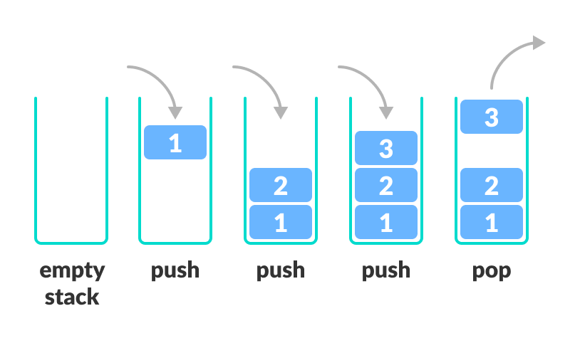

# Pilhas em C++

`std::stack` é um container C++ da STL do tipo *LIFO (Last In, First Out)*, ou seja, inserção e remoção sempre acontecem no topo da pilha como na figura abaixo.



Algumas aplicações de pilha:
- Funções recursivas
- Mecanismos de desfazer/refazer de editores de texto
- Calculadoras
- Jogos de carta
- etc

Os métodos e atributos de uma `stack` podem ser vistos em: https://www.cplusplus.com/reference/stack/stack/

## Funções básicas

No geral usamos as funções de pilhas C++ abaixo:
- `push()` insere um elemento.
- `top()` acessa o elemento do topo, mas não remove.
- `pop()` remove o elemento do topo da pilha, e retorna nada.
- `empty()` testa se a pilha está vazia.

```C++
#include <iostream>
#include <stack>

int main(void)
{
  std::stack<int> pilha;
 
  pilha.push(10); 
  pilha.push(0); 
  pilha.push(99);
 
  while(pilha.empty() == false){
      std::cout << pilha.top() << ' ';
      pilha.pop();
  }

  std::cout << std::endl;
 
  return 0;
}
```

```
$ g++ -Wall -g  pilha.cpp
$ ./a.out
99 0 10
```

Outras duas funções de pilhas:
- `size()` retorna o tamanho da pilha.
- `swap()` troca  o valor de argumento pelo elemento do topo da pilha.

## Exemplo: detectar palíndromos

Um palíndromo é toda palavra que podemos ler de trás para frente. Podemos resolver este problema usando uma pilha: primeiro inserimos todas as letras em uma pilha, depois comparamos cada letra da palavra (frente para tràs) com o topo da pilha. A primeira letra que não é igual paramos. Se a pilha terminar vazia significa que a palavra é palíndromo.

```C++
#include <iostream>
#include <stack>
#include <string>

int main(void)
{
    std::stack<char> pilha;
    std::string palavra;

    std::cin >> palavra;
    for(auto i=0; i < palavra.size(); i++)
        pilha.push(palavra[i]);

    for(auto i=0; i < palavra.size(); i++){
        if(pilha.top() != palavra[i])
            break;
        pilha.pop();
    }

    if(pilha.empty() == true)
        std::cout << "SIM" << std::endl;
    else 
        std::cout << "NAO" << std::endl;

    return 0;
}
```

## Emular pilhas com vetores

Podemos "emular" uma pilha usando `std::vector` de forma direta como no exemplo abaixo:
```C++
#include <iostream>
#include <vector>

int main(void)
{
  std::vector<int> pilha;
 
  pilha.push_back(10); 
  pilha.push_back(0); 
  pilha.push_back(99);
 
  while(pilha.empty() == false){
      std::cout << pilha.back() << ' ';
      pilha.pop_back();
  }

  std::cout << std::endl;
 
  return 0;
}
```
