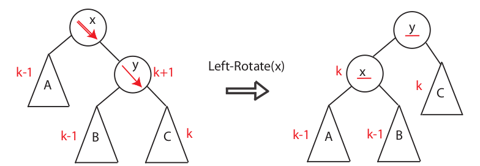

# Árvores AVL

Veremos abaixo os apssos para inserção e rotações em árvores AVL.

## Pseudo-código de inserção

O pseudo-código abaixo mostra os principais passos de inserção com balanceamento de nós.
```
Insere valor v na árvore X recursivamente
Atualiza alturas

Calcula fator de balanceamento FB
Se FB > 1
    Se v < esquerda de X
        return rotação a direita de X
    Senão Se v > esquerda de X
        return rotação dupla esquerda-direita de X

Se FB < -1
    Se v > direita de X
        return rotação a esquerda de X
    Senão Se v < direita de X
        return rotação dupla direita-esquerda de X

return X
```

## Pseudo-código de rotação simples

A figura abaixo mostra como uma rotação a esquerda é realizada onde o pivô é $X$.



O pseudo-código abaixo mostra os passos para duas rotações simples, esquerda e direita.
```
Rotação_Esquerda( X )
    Y = direita de X
    B = esquerda de Y
    esquerda de Y = X
    direita de X = B
    Atualiza alturas de X
    Atualiza alturas de Y
    return Y

Rotação_Direita( X )
    Y = esquerda de X
    B = direita de Y
    direita de Y = X
    esqueda de X = B
    Atualiza alturas de X
    Atualiza alturas de Y
    return Y
```


## Rotação dupla

Em rotações duplas, suponha que o pivô seja $x$, 
uma rotação dupla é necessária caso a inserção ocorra 
na *sub-árvore à esquerda do filho à direita de* $x$ ou
na *sub-árvore à direita do filho à esquerda de* $x$.
Uma rotação dupla equivale a duas rotações simples em sequência.
A figura abaixo demonstra um exemplo de rotação
dupla a esquerda.


```
Rotação_Esquerda_Direita( X )
    esquerda de X = Rotação_Esquerda( esquerda de X )
    return Rotação_Direita ( X )

Rotação_Direita_Esquerda( X )
    direita de X = Rotação_Direita( direita de X )
    return Rotação_Esquerda ( X )
```


## Remoção

TODO

## Referências
- [MIT - Introduction to Algorithms (2020) - AVL Notes](https://ocw.mit.edu/courses/6-006-introduction-to-algorithms-spring-2020/resources/mit6_006s20_lec7/)
- [MIT - Introduction to Algorithms (2008) - AVL Trees](https://ocw.mit.edu/courses/6-006-introduction-to-algorithms-spring-2008/resources/lec4/)